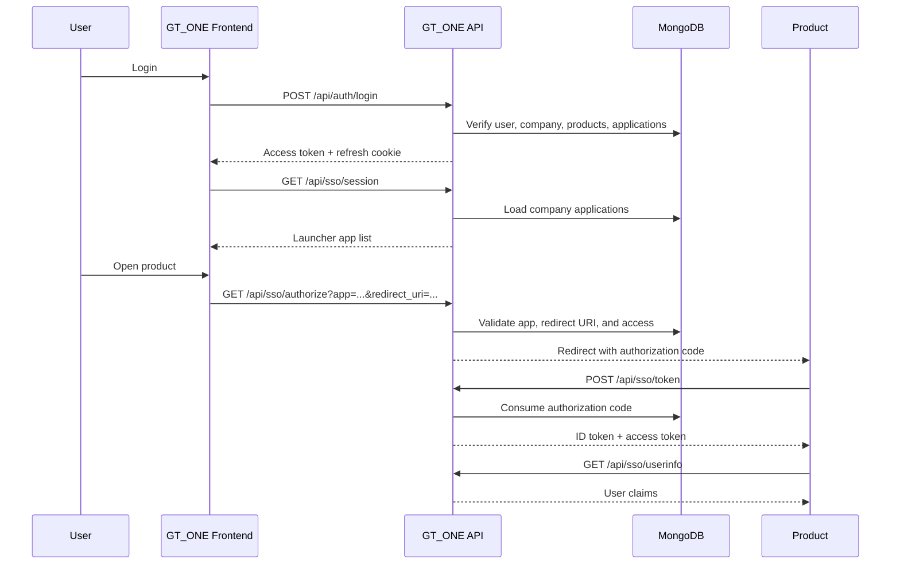

# GT_ONE Deployment And SSO Runbook

## Architecture

GT_ONE is the identity hub and product launcher. Products such as HRMS, TMS, CRM, PMS, PSA, and DMS should not own the main login flow. They should trust GT_ONE through OpenID Connect when possible, or through the GT_ONE connector package when the product has no built-in OIDC support.

## Main Flow



## Data Ownership

Keep user identity, companies, application registry, company-application access, SSO sessions, refresh tokens, signing keys, authorization codes, and audit events in the GT_ONE database.

Do not move each product's business data into the SSO database. HRMS should keep HRMS data, TMS should keep TMS data, and so on. GT_ONE should send identity claims such as user id, email, role, company id, tenant id, company code, products, app key, and application id.

## Required Server Environment

Use production values before deployment:

```env
NODE_ENV=production
BACKEND_URL=https://gt-one.example.com
FRONTEND_URL=https://gt-one.example.com
SSO_PUBLIC_ORIGIN=https://gt-one.example.com
SSO_PUBLIC_API_URL=https://gt-one.example.com/api
SSO_FRONTEND_URL=https://gt-one.example.com
SSO_LOGIN_URL=https://gt-one.example.com/login
SSO_OIDC_ISSUER=https://gt-one.example.com
SSO_COOKIE_DOMAIN=.example.com
SSO_COOKIE_SECURE=true
SSO_COOKIE_SAMESITE=lax
CORS_ALLOWED_ORIGINS=https://gt-one.example.com,https://hrms.example.com,https://tms.example.com
JWT_ALLOWED_ALGS=RS256,HS256
JWT_SIGNING_ALG=RS256
```

Use `SSO_COOKIE_DOMAIN` only when GT_ONE and products are on related subdomains. For one-host deployment, leave it empty. Use `SSO_COOKIE_SAMESITE=none` only when the browser must send cookies in a true cross-site context; it requires HTTPS.

## Required Client Environment

For a same-host deployment, build the client with:

```env
VITE_API_URL=/api
VITE_HRMS_BASE_URL=https://hrms.example.com
VITE_TMS_BASE_URL=https://tms.example.com
VITE_PMS_BASE_URL=https://tms.example.com
```

## Product Connection Method

Preferred no-code path:

1. Add or update the product in GT_ONE Application Registry.
2. Set the product base URL and callback redirect URI.
3. Rotate the client secret.
4. Open the connector template in GT_ONE and copy the No-Code OIDC settings.
5. Paste discovery URL, client id, client secret, scopes, and callback URL into the product's OIDC/OAuth settings.
6. Assign the application to the company so it appears in the launcher.

Fallback for custom products:

Use `packages/gtone-product-connector` when the product has no built-in OIDC/OAuth login settings.

## Product Module Assignment

GT_ONE stores module access on the company-product assignment. After a product is assigned to a company, open the product module screen and enable or disable the modules for that product. Product SSO tokens include the enabled module claims so connected products can hide disabled modules without adding custom GT_ONE code.

## Smoke Tests

After deployment:

```powershell
Invoke-RestMethod https://gt-one.example.com/api/health
Invoke-RestMethod https://gt-one.example.com/.well-known/openid-configuration
Invoke-RestMethod https://gt-one.example.com/.well-known/jwks.json
```

Then log in through GT_ONE, open the launcher, click a product, and confirm the product receives an authorization code and exchanges it through `/api/sso/token`.
